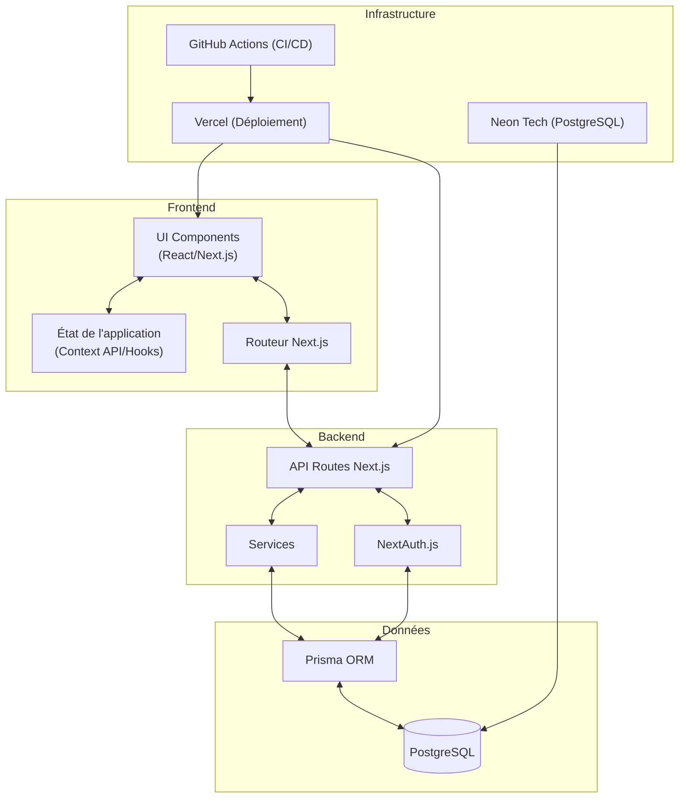

# Diagramme d'Architecture

Ce diagramme représente l'architecture technique de l'application GoofyTrack.

```mermaid
flowchart TB
    subgraph "Frontend"
        UI["UI Components\n(React/Next.js)"]
        State["État de l'application\n(Context API/Hooks)"]
        Router["Routeur Next.js"]
    end
    
    subgraph "Backend"
        API["API Routes Next.js"]
        Auth["NextAuth.js"]
        Services["Services"]
    end
    
    subgraph "Données"
        Prisma["Prisma ORM"]
        DB[(PostgreSQL)]
    end
    
    subgraph "Infrastructure"
        Vercel["Vercel (Déploiement)"]
        NeonDB["Neon Tech (PostgreSQL)"]
        GitHub["GitHub Actions (CI/CD)"]
    end
    
    UI <--> State
    UI <--> Router
    Router <--> API
    API <--> Auth
    API <--> Services
    Services <--> Prisma
    Auth <--> Prisma
    Prisma <--> DB
    
    Vercel --> UI
    Vercel --> API
    NeonDB --> DB
    GitHub --> Vercel
```
