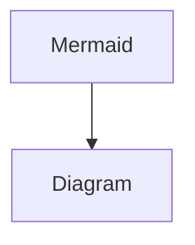
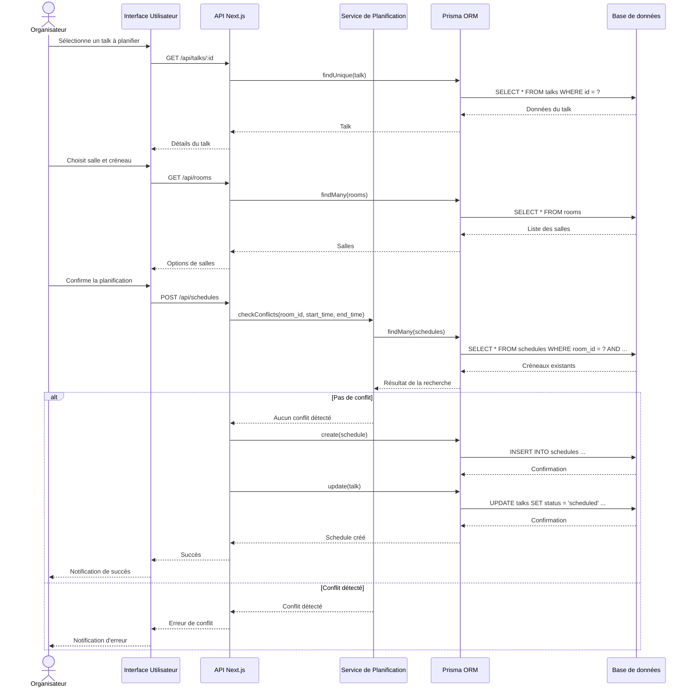
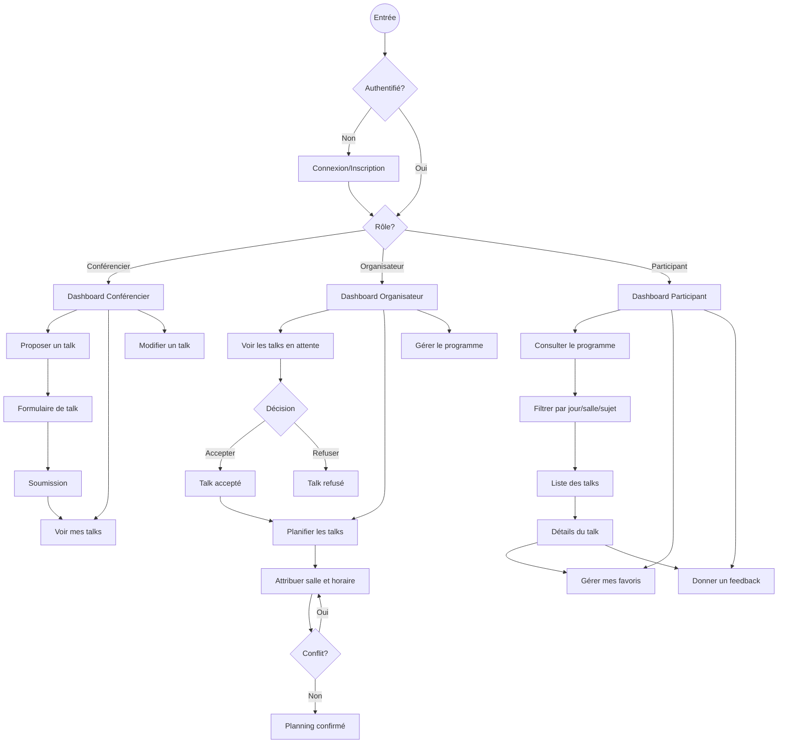
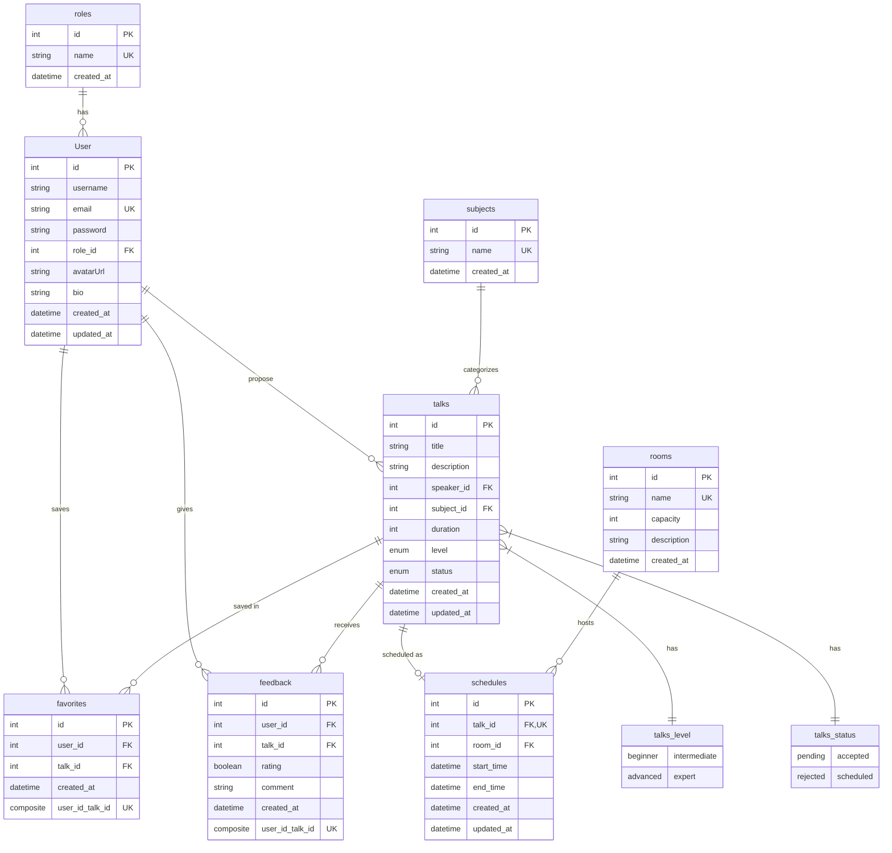
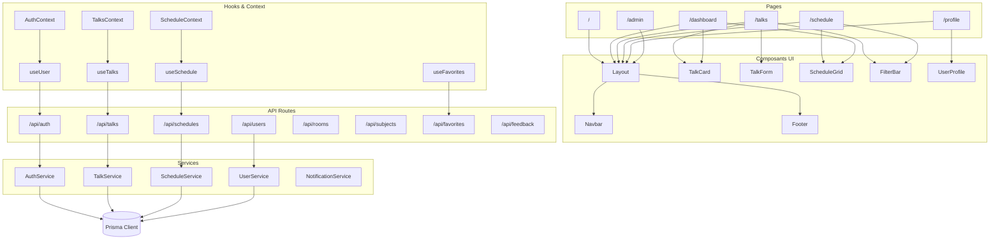
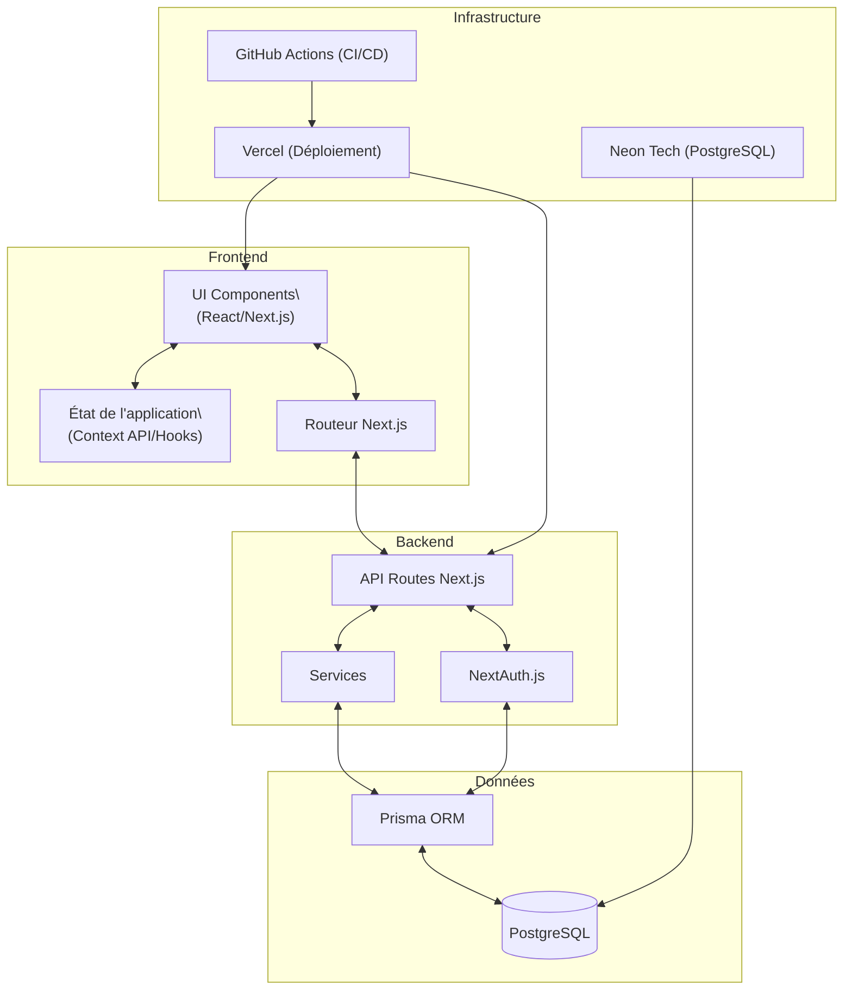

## **1. Introduction et Contexte**

GoofyTrack est une application web développée pour gérer un événement technique réunissant des centaines de participants et de conférenciers (type Devoxx France). L'objectif est de proposer un outil simple, fluide et ergonomique permettant aux différents acteurs de l'événement d'interagir efficacement.

**1.1 Objectifs du Projet**

L'application vise à répondre aux besoins de trois types d'utilisateurs :

- **Conférenciers** : Proposer, modifier ou supprimer des talks
- **Organisateurs** : Planifier les interventions et organiser le programme
- **Public** : Consulter un planning clair et interactif, filtrer les contenus, et gérer ses favoris

**1.2 Fonctionnalités Principales**

Le MVP (Minimum Viable Product) de l'application comprend :

- Gestion des talks (création, modification, suppression)
- Gestion des statuts de talks (en attente, accepté, refusé, planifié)
- Planning avec créneaux entre 9h et 19h, répartis sur 5 salles
- Système d'authentification avec différents rôles
- Interface responsive (web et mobile)
- Vue privée pour la gestion et la soumission
- Vue publique pour la consultation du planning

## **2. Modèle de Données**

**2.1 Schéma Relationnel**

Notre modèle de données est structuré autour des entités principales suivantes :

**Users**

- Stocke les informations des utilisateurs (conférenciers, organisateurs, public)
- Attributs : id, username, email, password, role_id, avatarUrl, bio
- Relations : Lié aux rôles, talks, favoris et feedback

**Roles**

- Définit les différents rôles des utilisateurs
- Attributs : id, name
- Valeurs : admin, organizer, speaker, attendee

**Talks**

- Contient les informations sur les présentations
- Attributs : id, title, description, speaker_id, subject_id, duration, level, status
- Relations : Lié aux utilisateurs (speakers), sujets, favoris, feedback et planning

**Subjects**

- Catégorisation des talks par thématique
- Attributs : id, name
- Exemples : JavaScript, TypeScript, React, Next.js, etc.

**Rooms**

- Informations sur les salles disponibles
- Attributs : id, name, capacity, description

**Schedules**

- Planification des talks dans les salles
- Attributs : id, talk_id, room_id, start_time, end_time
- Contraintes : Pas de chevauchement de talks dans une même salle

**Favorites**

- Gestion des talks favoris des utilisateurs
- Attributs : id, user_id, talk_id

**Feedback**

- Retours des utilisateurs sur les talks
- Attributs : id, user_id, talk_id, rating, comment

**2.2 Diagramme Entité-Relation**

`CopyInsertUser (1) --- (*) Talks (Speaker)
User (1) --- (*) Favorites
User (1) --- (*) Feedback
Talks (1) --- (0..1) Schedules
Rooms (1) --- (*) Schedules
Subjects (1) --- (*) Talks
Roles (1) --- (*) Users`

## **3. Architecture Technique**

**3.1 Stack Technologique**

GoofyTrack est développé avec les technologies suivantes :

**Frontend**

- **Framework** : Next.js 15.3.2
- **Langage** : TypeScript
- **Gestion d'état** : Context API / Hooks
- **UI Framework** : Tailwind CSS avec composants Radix UI
- **Authentification** : NextAuth.js

**Backend**

- **API** : API Routes de Next.js
- **ORM** : Prisma 6.7.0
- **Base de données** : PostgreSQL
- **Authentification** : JWT via NextAuth.js

**Infrastructure**

- **Déploiement** : Vercel
- **Base de données** : Neon Tech (PostgreSQL)
- **Environnement de développement** : Docker (PostgreSQL, pgAdmin, Mailhog)
- **CI/CD** : GitHub Actions

**3.2 Architecture Applicative**

L'application suit une architecture en couches :

1. **Couche Présentation** : Composants React/Next.js
2. **Couche Logique** : API Routes Next.js et services
3. **Couche Accès aux Données** : Prisma ORM
4. **Couche Persistance** : PostgreSQL

5. 1. **Couche Présentation** : Composants React/Next.js
6. 2. **Couche Logique** : API Routes Next.js et services
7. 3. **Couche Accès aux Données** : Prisma ORM
8. 4. **Couche Persistance** : PostgreSQL

**3.3 Sécurité**

- Authentification basée sur NextAuth.js avec JWT
- Hachage des mots de passe avec bcrypt
- Contrôle d'accès basé sur les rôles
- Protection CSRF intégrée à Next.js
- Variables d'environnement sécurisées

## **4. Cas d'Usage**

**4.1 Parcours Conférencier**

1. **Inscription/Connexion**
   ◦ Le conférencier s'inscrit ou se connecte à l'application
   ◦ Le système lui attribue le rôle "speaker"
2. **Proposition de Talk**
   ◦ Le conférencier remplit un formulaire avec les détails du talk
   ◦ Il sélectionne un sujet, définit la durée et le niveau
   ◦ Le talk est enregistré avec le statut "en attente"
3. **Gestion des Propositions**
   ◦ Le conférencier peut consulter l'état de ses propositions
   ◦ Il peut modifier ou supprimer ses talks non planifiés

**4.2 Parcours Organisateur**

1. **Validation des Talks**
   ◦ L'organisateur consulte la liste des talks en attente
   ◦ Il peut accepter ou refuser chaque proposition
2. **Planification**
   ◦ Pour les talks acceptés, l'organisateur attribue une salle et un créneau
   ◦ Le système vérifie qu'il n'y a pas de conflit (même salle, même horaire)
   ◦ Le statut du talk passe à "planifié"
3. **Gestion du Programme**
   ◦ L'organisateur peut visualiser et modifier le planning global
   ◦ Il peut réorganiser les talks si nécessaire

**4.3 Parcours Public**

1. **Consultation du Planning**
   ◦ L'utilisateur consulte le programme des talks planifiés
   ◦ Il peut filtrer par jour, salle, sujet ou niveau
2. **Gestion des Favoris**
   ◦ L'utilisateur peut ajouter des talks à ses favoris
   ◦ Il peut consulter sa liste personnalisée de favoris
3. **Feedback**
   ◦ Après un talk, l'utilisateur peut laisser une évaluation et un commentaire

## **5. Justifications Techniques et Évolutions**

**5.1 Choix Techniques**

**Next.js + TypeScript**

- **Justification** : Framework React moderne avec rendu côté serveur et génération statique
- **Avantages** : Performance, SEO, typage fort, routing intégré
- **Alternative considérée** : React + Express (rejeté car Next.js offre une solution plus intégrée)

**Prisma ORM**

- **Justification** : ORM moderne avec typage fort et migrations intégrées
- **Avantages** : Type-safety, auto-complétion, modèle déclaratif
- **Alternative considérée** : Sequelize (rejeté car moins bien intégré avec TypeScript)

**PostgreSQL**

- **Justification** : Base de données relationnelle robuste et performante bdd gratuite avec NEon Tech sinon on partirait sur du mysql car postgresql est plus axé écriture et mysql lecture
- **Avantages** : Fiabilité, support des transactions, contraintes d'intégrité
- **Alternative considérée** : MongoDB (rejeté car le modèle de données est fortement relationnel)

**NextAuth.js**

- **Justification** : Solution d'authentification intégrée à Next.js
- **Avantages** : Support de multiples providers, gestion des sessions, JWT
- **Alternative considérée** : Auth0, Clerk (rejeté pour garder le contrôle sur les données utilisateurs)

**5.2 Évolutions Futures**

**Court terme**

- Implémentation du système de favoris
- Ajout de filtres avancés (niveau, conférencier)
- Thème clair/sombre

**Moyen terme**

- Génération automatique de planning optimisé
- Système de notifications par email
- Statistiques sur l'occupation des salles

**Long terme**

- Application mobile native
- Intégration avec des calendriers externes (Google Calendar, iCal)
- Système de recommandation basé sur les préférences utilisateur

**5.3 Défis et Solutions**

**Gestion des conflits de planning**

- **Défi** : Éviter les chevauchements de talks dans une même salle
- **Solution** : Contraintes de validation dans l'API et alertes visuelles dans l'interface

**Performance avec grand nombre d'utilisateurs**

- **Défi** : Maintenir la réactivité avec des centaines d'utilisateurs simultanés
- **Solution** : Mise en cache, pagination, et optimisation des requêtes Prisma

**Expérience utilisateur cohérente**

- **Défi** : Assurer une UX fluide sur tous les appareils
- **Solution** : Design responsive, tests sur différents appareils, et composants UI optimisés

---

# Diagramme de Séquence - Planification d'un Talk

Ce diagramme représente les interactions entre les différents composants lors de la planification d'un talk.

# Diagramme de Flux Utilisateur

Ce diagramme représente les différents parcours utilisateurs dans l'application GoofyTrack.

# Diagramme de composant

Ce diagramme représente la structure des composants de l'application GoofyTrack.

# Diagramme d'Architecture

Ce diagramme représente l'architecture technique de l'application GoofyTrack.

