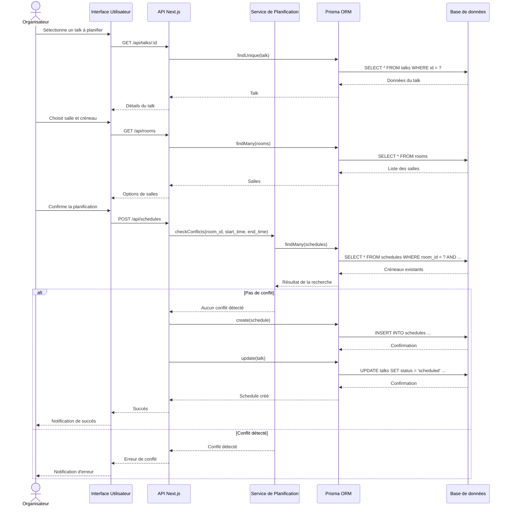

# Diagramme de Séquence - Planification d'un Talk

Ce diagramme représente les interactions entre les différents composants lors de la planification d'un talk.

```mermaid
sequenceDiagram
    actor Organisateur
    participant UI as Interface Utilisateur
    participant API as API Next.js
    participant Service as Service de Planification
    participant Prisma as Prisma ORM
    participant DB as Base de données
    
    Organisateur->>UI: Sélectionne un talk à planifier
    UI->>API: GET /api/talks/:id
    API->>Prisma: findUnique(talk)
    Prisma->>DB: SELECT * FROM talks WHERE id = ?
    DB-->>Prisma: Données du talk
    Prisma-->>API: Talk
    API-->>UI: Détails du talk
    
    Organisateur->>UI: Choisit salle et créneau
    UI->>API: GET /api/rooms
    API->>Prisma: findMany(rooms)
    Prisma->>DB: SELECT * FROM rooms
    DB-->>Prisma: Liste des salles
    Prisma-->>API: Salles
    API-->>UI: Options de salles
    
    Organisateur->>UI: Confirme la planification
    UI->>API: POST /api/schedules
    API->>Service: checkConflicts(room_id, start_time, end_time)
    Service->>Prisma: findMany(schedules)
    Prisma->>DB: SELECT * FROM schedules WHERE room_id = ? AND ...
    DB-->>Prisma: Créneaux existants
    Prisma-->>Service: Résultat de la recherche
    
    alt Pas de conflit
        Service-->>API: Aucun conflit détecté
        API->>Prisma: create(schedule)
        Prisma->>DB: INSERT INTO schedules ...
        DB-->>Prisma: Confirmation
        API->>Prisma: update(talk)
        Prisma->>DB: UPDATE talks SET status = 'scheduled' ...
        DB-->>Prisma: Confirmation
        Prisma-->>API: Schedule créé
        API-->>UI: Succès
        UI-->>Organisateur: Notification de succès
    else Conflit détecté
        Service-->>API: Conflit détecté
        API-->>UI: Erreur de conflit
        UI-->>Organisateur: Notification d'erreur
    end
```
