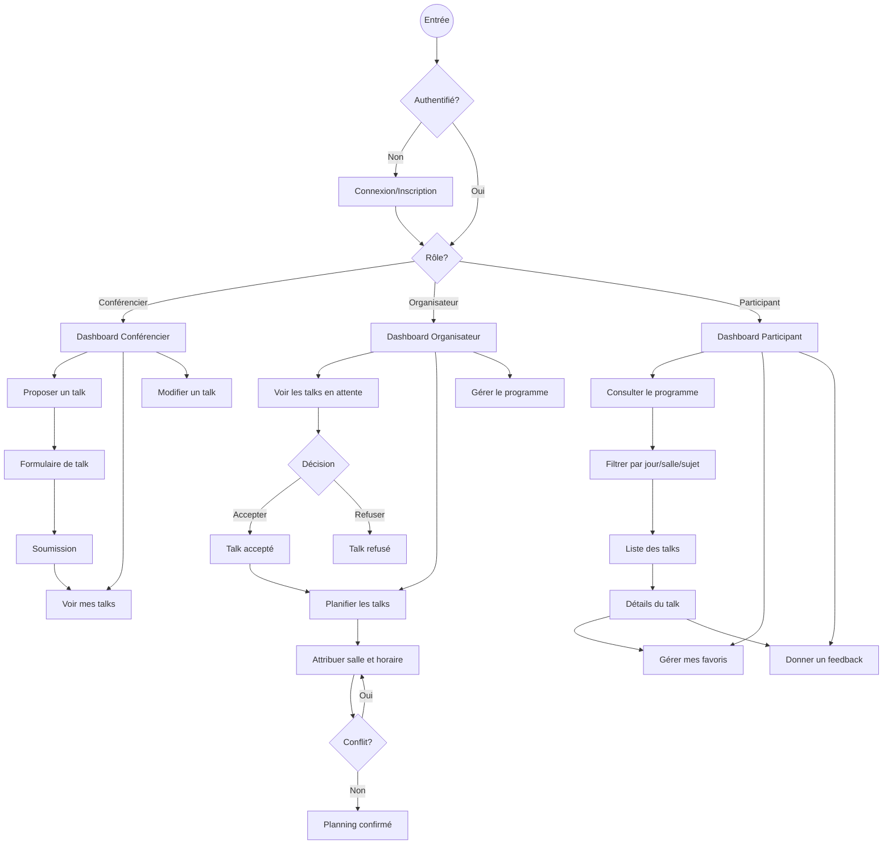

# Diagramme de Flux Utilisateur

Ce diagramme représente les différents parcours utilisateurs dans l'application GoofyTrack.

```mermaid
flowchart TD
    Start((Entrée)) --> Auth{Authentifié?}
    Auth -->|Non| Login[Connexion/Inscription]
    Auth -->|Oui| Role{Rôle?}
    
    Login --> Role
    
    Role -->|Conférencier| Speaker[Dashboard Conférencier]
    Role -->|Organisateur| Organizer[Dashboard Organisateur]
    Role -->|Participant| Attendee[Dashboard Participant]
    
    Speaker --> S1[Proposer un talk]
    Speaker --> S2[Voir mes talks]
    Speaker --> S3[Modifier un talk]
    
    S1 --> TalkForm[Formulaire de talk]
    TalkForm --> TalkSubmit[Soumission]
    TalkSubmit --> S2
    
    Organizer --> O1[Voir les talks en attente]
    Organizer --> O2[Planifier les talks]
    Organizer --> O3[Gérer le programme]
    
    O1 --> ReviewTalk{Décision}
    ReviewTalk -->|Accepter| AcceptTalk[Talk accepté]
    ReviewTalk -->|Refuser| RejectTalk[Talk refusé]
    AcceptTalk --> O2
    
    O2 --> ScheduleForm[Attribuer salle et horaire]
    ScheduleForm --> ScheduleCheck{Conflit?}
    ScheduleCheck -->|Oui| ScheduleForm
    ScheduleCheck -->|Non| ScheduleConfirm[Planning confirmé]
    
    Attendee --> A1[Consulter le programme]
    Attendee --> A2[Gérer mes favoris]
    Attendee --> A3[Donner un feedback]
    
    A1 --> Filter[Filtrer par jour/salle/sujet]
    Filter --> TalkList[Liste des talks]
    TalkList --> TalkDetails[Détails du talk]
    TalkDetails --> A2
    TalkDetails --> A3
```
